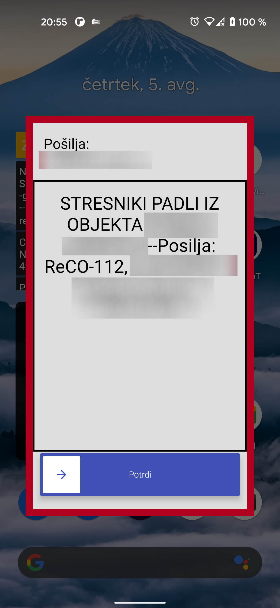

# BeeperAlarm
Android sms alarm app

## OPIS

BeeperAlarm je android aplikacija, ki ob prejemu SMS sporočila sproži alarm.

## PRENOS

Najnovejša verzija aplikacije (trenutno beta verzija) za prenos je na volju tu:

[**BeeperAlarm-v1-1.0.0-beta.apk**](https://github.com/devprprinc/beeperalarm/releases/download/v1-1.0.0-beta/BeeperAlarm-v1-1.0.0-beta.apk)

### Funkcije
* filtriranje preko pošiljateljeve številke ali vsebujoče besede v SMS sporočilu
* nastavljenja več filtrov
* nastavljanje melodije alarma za posamezni filter
* pripomoček na namizni strani za hiter vklop/izklop aplikacije

#### Dovoljenja
Za delovanje aplikacija potrebuje naslednja dovoljenja:
* SMS (branje vseh SMS sporočil)
* Stiki (za lepši izpis pošiljatelja)
* Prekrivanje drugih aplikacij (za avtomatski prikaz okna ob alarmu)

Za stabilno delovanje se priporoča tudi odstranitev nastavitve "Odstrani dovoljenja, če aplikacija ni v uporabi".

Pri nekaterih proizvajalcih mobilnih telefonov (Samsung, Huawei ...) je potrebno tudi aplikaciji onemogočiti nastavitev "optimizacija baterije" oz. podobno.
Aplikacija je razvita za android 10 in višje in ne deluje na napravah z "Go edition" OS.

### Zaslonske slike

Zaslonske slike aplikacije:

## Dovoljenja
BeeperAlarm je prosta in odprta programska oprema: lahko jo uporabljaš, preučuješ in izboljšaš po želji. Lahko jo distributiraš in/ali spremeniš pod pogoji [GNU General Public License](https://www.gnu.org/licenses/gpl.html), kot jo je izdala Free Software Foundation v različici 3 ali po izbiri v katerikoli novejši različici.

© Klemen Rahne, 2021

### Zunanje knjižnice

Slide To Act (Nicola Corti, licence MIT) https://github.com/cortinico/slidetoact

### Zasebnost
Aplikacija ne zbira in ne pošilja nobenih uporabnikovih podatkov (ne zahteva dostopa do internetne povezave). Aplikacija shranjuje samo zgodovino prejetih alarmov, kateri se ne delijo naprej.

## Ostalo

V primeru napak, novih funkcionalnosti ali nedelovanje aplikacije piši na: dev.prprinc@gmail.com

Ta aplikacija je zastonj in brez oglasov.

